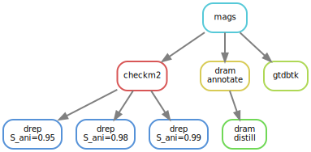

[](https://github.com/3d-omics/mg_annotate/actions)


# Snakemake workflow: `mg_anntate`

A Snakemake workflow to annotate mags

## Usage
1. Make sure you have `conda`, `mamba` and `snakemake` installed.
    ```bash
    conda --version
    snakemake --version
    mamba --version
    ```

2. Clone the git repository in your terminal and get in:
    ```bash
    git clone git@github.com:3d-omics/mg_annotate.git
    cd mg_annotate
    ```

3. Test your installation by running the test data. It will download all the necesary software through conda / mamba. It should take less than 5 minutes.
    ```bash
    snakemake -np
    ```

4. Run it with your own data:

    1. Edit `config/features.yml` with reference databases:

    ```yaml
    # All fastas should be called .fa.gz
    mag_catalogue_dir: resources/mag_catalogue/

    databases:
      checkm2: resources/databases/checkm2/20210323/uniref100.KO.1.dmnd
      dram: resources/databases/dram/20230811
      gtdbtk: resources/databases/gtdbtk/release214
    ```

    3. Edit `config/params.yml` with execution parameters. The defaults are reasonable.


5. Run the pipeline
     ```
     snakemake --use-conda --jobs 8 all
     ```


## Rulegraph




## Features
- Dereplication with `dRep`. Multiple secondary ANIs can be providede
- Annotation with `checkm2`, `gtdbtk` and `dram`


## References

- [`dRep`](https://github.com/MrOlm/drep)
- [`GTDB-TK`](https://github.com/Ecogenomics/GTDBTk)
- [`DRAM`](https://github.com/WrightonLabCSU/DRAM)
- [`checkm2`](https://github.com/chklovski/CheckM2)
